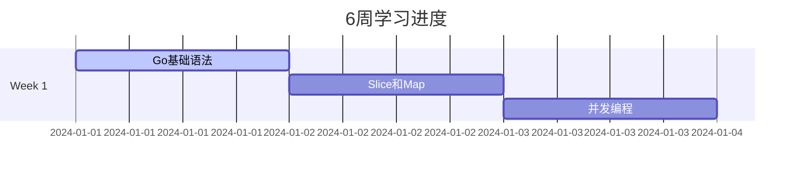

# 🚀 Go后端开发工程师6周面试准备计划

<div align="center">
  
  
  
</div>

## 📋 项目简介

这是一个为期6周的Go后端开发工程师面试准备计划，帮助你系统性地掌握Go语言、网络编程、云原生技术、算法、系统设计、Redis等核心技能，为求职面试做好充分准备。

## 🎯 学习目标

- **Go语言精通**: 从基础语法到高级并发模式
- **网络编程深刻理解**: TCP/IP、HTTP、gRPC等协议
- **云原生技术栈**: Docker、Kubernetes、Service Mesh
- **算法能力提升**: LeetCode 100+ 题目练习
- **系统设计能力**: 分布式系统架构设计
- **Redis实战应用**: 缓存、队列、分布式锁等
- **AI后端开发**: 了解最新技术趋势

## 📅 6周学习路径

### 📍 Week 1: Go语言基础强化
- Day 1-7: 语法精通 → 数据结构深入 → 并发编程 → 错误处理 → 测试实践

### 📍 Week 2: 网络编程与协议
- Day 8-14: TCP/IP → Socket → HTTP → WebSocket → gRPC → 网络库实战

### 📍 Week 3: 云原生技术栈
- Day 15-21: Docker → K8s → Service Mesh → 监控告警 → CI/CD

### 📍 Week 4: 算法与数据结构
- Day 22-28: 数组链表 → 树图 → 动态规划 → 回溯算法 → 竞赛模拟

### 📍 Week 5: 系统设计
- Day 29-35: 架构原则 → 数据库 → 消息队列 → 高可用 → 安全认证

### 📍 Week 6: Redis实战与前沿技术
- Day 36-42: Redis深度 → AI集成 → 面试技巧 → 综合复习

## 📁 项目结构

```
.
├── README.md                 # 项目总览
├── .gitignore               # Git忽略文件
├── templates/               # 模板文件
│   ├── daily-note.md        # 每日学习模板
│   └── quiz-generator.py    # 测验生成器
├── weeks/                   # 6周计划详情
│   ├── week1/              # Go语言基础
│   ├── week2/              # 网络编程
│   ├── week3/              # 云原生
│   ├── week4/              # 算法数据结构
│   ├── week5/              # 系统设计
│   └── week6/              # Redis与AI
├── daily-quizzes/          # 每日测验
├── progress/               # 学习进度
│   └── tracker.md         # 进度追踪
└── resources/              # 学习资源
    ├── cheatsheets/        # 速查表
    ├── code-examples/      # 代码示例
    └── references/         # 参考资料
```

## ✨ 项目特色

### 🎮 高可执行性
- 每日明确的学习目标和任务
- 详细的项目实践指导
- 模块化的知识体系设计

### 📊 可记录性
- Markdown格式的学习笔记
- 进度追踪系统
- 每日测验和评分机制
- GitHub托管的学习历程

### 🔄 学习闭环
1. **学习**: 每日新知识输入
2. **实践**: 动手编码练习
3. **测验**: 知识掌握测试
4. **总结**: 学习要点记录
5. **复习**: 定期回顾巩固

## 🛠️ 快速开始

### 1. 克隆仓库
```bash
git clone https://github.com/yourusername/go-backend-interview-prep.git
cd go-backend-interview-prep
```

### 2. 设置环境
```bash
# 安装依赖
sudo apt-get install make python3

# 生成每日测验
python3 templates/quiz-generator.py
```

### 3. 创建学习笔记
```bash
# 复制每日模板
cp templates/daily-note.md progress/day-1.md

# 开始学习记录
vim progress/day-1.md
```

### 4. 追踪进度
```bash
# 更新进度
vim progress/tracker.md

# 查看统计
git log --oneline --graph
```

## 📋 每日学习流程

1. **阅读计划** (30分钟)
   - 查看当日学习目标
   - 预习新知识内容

2. **深入学习** (2小时)
   - 观看教程/阅读文档
   - 实践编码练习
   - 记录关键要点

3. **代码实践** (1小时)
   - 完成编程作业
   - 调试和优化代码
   - 提交到GitHub

4. **每日测验** (30分钟)
   - 完成测验题目
   - 自我评分
   - 记录错误和反思

5. **总结反思** (30分钟)
   - 记录学习心得
   - 更新进度追踪
   - 规划明日任务

## 📊 学习统计

### 🎯 目标指标
- **代码提交**: 连续42天
- **LeetCode**: 100+ 题目
- **项目**: 5个实战项目
- **测验**: 平均80分以上

### 📈 进度可视化


## 🏆 成就系统

### 🥉 青铜级 (Week 1 完成)
- Go语言基础扎实
- 完成第一个项目

### 🥈 白银级 (Week 3 完成)
- 掌握云原生技术
- 完成部署实践

### 🥇 黄金级 (Week 5 完成)
- 系统设计能力
- 算法通过率80%

### 💎 钻石级 (Week 6 完成)
- 全栈技能掌握
- 获得面试Offer

## 📚 学习资源

### 📖 推荐书籍
- [Go语言设计与实现](https://draveness.me/golang/)
- [TCP/IP详解](https://book.douban.com/subject/1088054/)
- [大型网站技术架构](https://book.douban.com/subject/25723064/)

### 🎥 视频教程
- [Go官方教程](https://go.dev/tour/)
- [Kubernetes官方教程](https://kubernetes.io/docs/tutorials/)
- [系统设计面试](https://www.youtube.com/c/GauravSen)

### 🔧 开发工具
- **IDE**: VSCode / GoLand
- **容器**: Docker Desktop
- **K8s**: minikube / kind
- **监控**: Grafana + Prometheus

## 🤝 贡献指南

欢迎提交PR来完善这个学习计划：

1. **Fork** 此仓库
2. **创建** 特性分支: `git checkout -b feature/AmazingFeature`
3. **提交** 更改: `git commit -m 'Add some AmazingFeature'`
4. **推送** 到分支: `git push origin feature/AmazingFeature`
5. **创建** Pull Request

## 📞 联系方式

- **邮箱**: your.email@example.com
- **GitHub**: [@yourusername](https://github.com/yourusername)
- **微信**: your-wechat-id

## 📄 License

This project is licensed under the MIT License - see the [LICENSE](LICENSE) file for details.

---

<div align="center">
  <p>⭐ 如果这个项目对你有帮助，请给个Star支持一下！</p>
  <p>Made with ❤️ by [Your Name]</p>
</div>